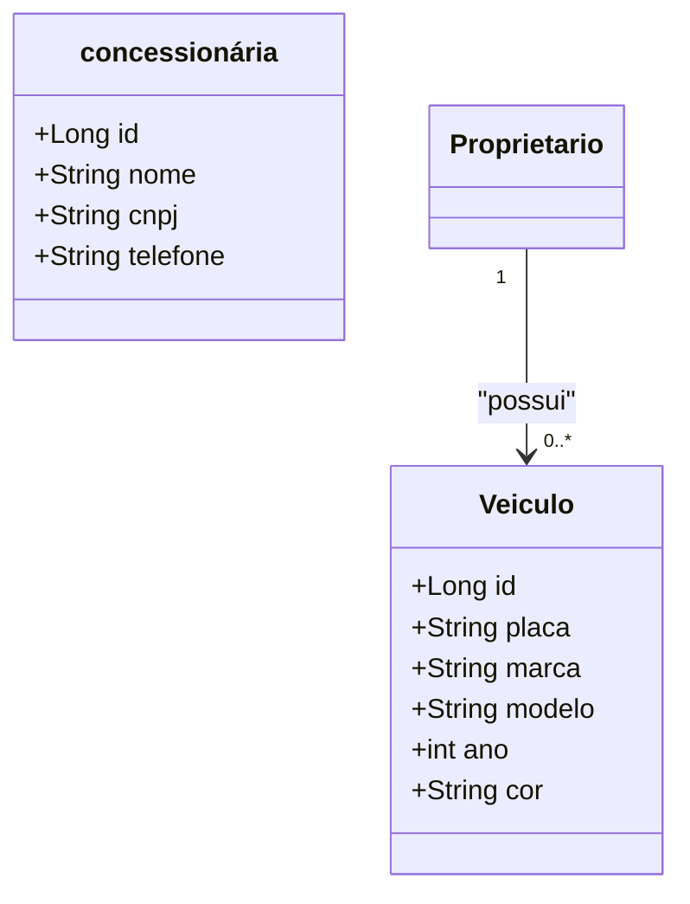

```mermaid
classDiagram
    class Veiculo {
        +Long id
        +String placa
        +String marca
        +String modelo
        +int ano
        +String cor
    }

    class concessionária {
        +Long id
        +String nome
        +String cnpj
        +String telefone
    }

    Proprietario "1" --> "0..*" Veiculo : "possui"

```
